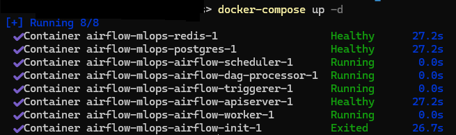
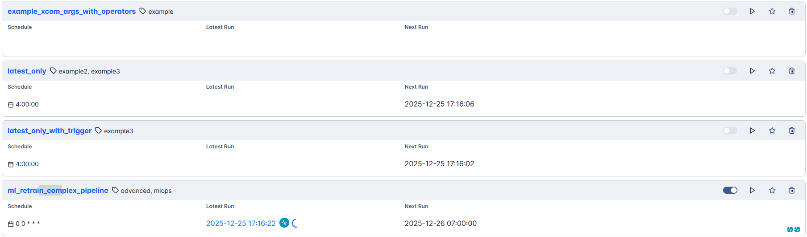
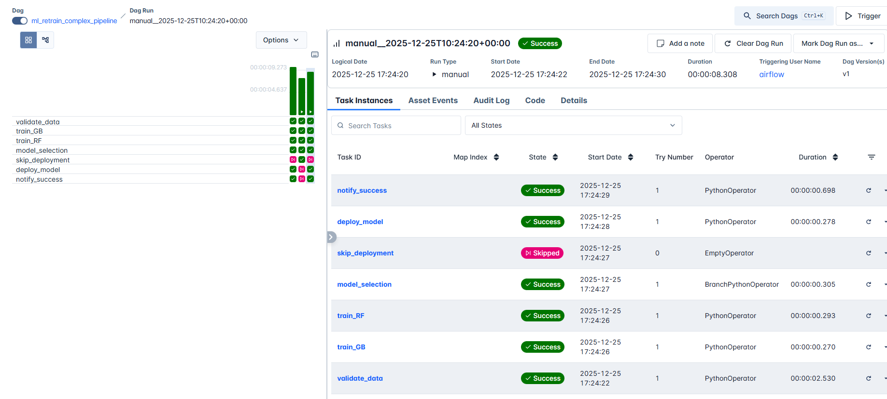
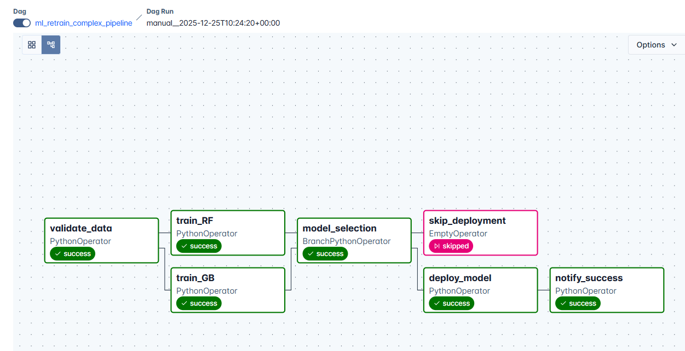
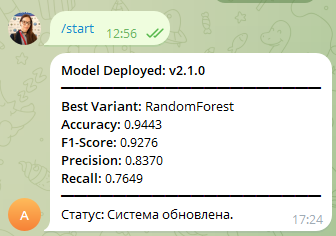

# Домашнее задание 5. 
Модификация DAG в Airflow для уведомлений о выводе новой модели в продакшен

## Создание структуры проекта

```
mkdir airflow-mlops; cd airflow-mlops
mkdir dags, logs, plugins, config
```

## Загрузка файла конфигурации

```
Invoke-WebRequest -Uri 'https://airflow.apache.org/docs/apache-airflow/stable/docker-compose.yaml' -OutFile 'docker-compose.yaml'
```

## Инициализация 

```
docker-compose up airflow-init
```

## Запуск Airflow 

```
docker-compose up -d
```


## Создаем бота
получаем TELEGRAM_TOKEN и TELEGRAM_CHAT_ID - вставляем их в файл .env и ml_retrain_pipeline.py

## Airflow 
1) На http://localhost:8081 вводим airflow/airflow 

2) Находим там ml_retrain_pipeline и запускаем его



3) Видим что вме окей





4) Получаем уведомление в чате в телеграме



## Останавливаем контейнер

```
docker-compose down -v
```
